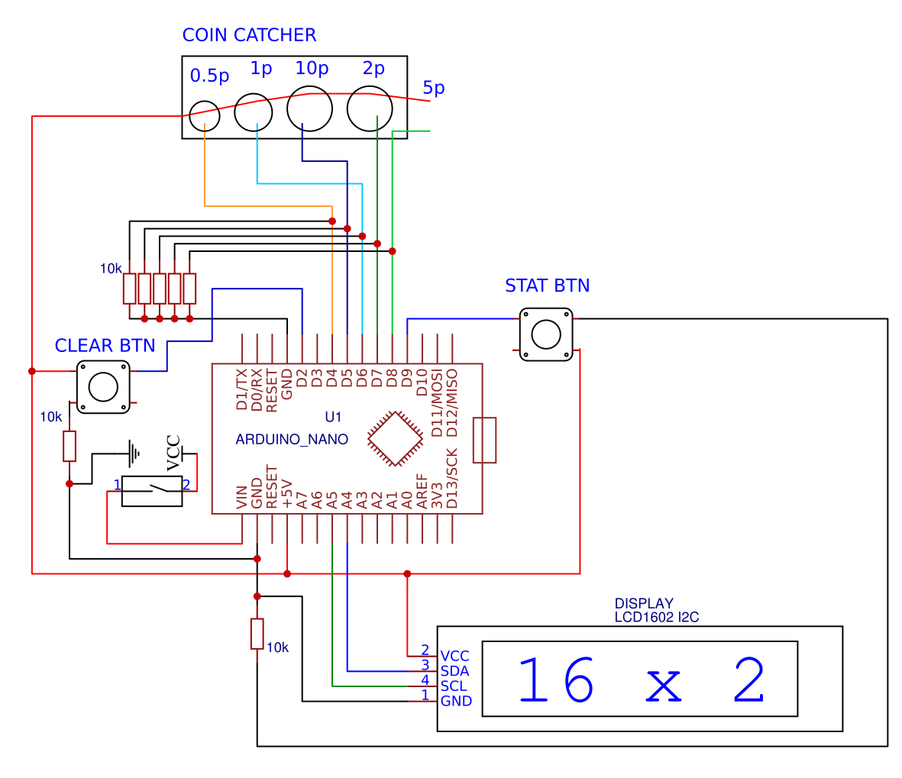

# Копилка на Arduino Nano

## Компоненты:

* 7 резисторов на 10 кОм
* [i2c lcd display 1602](https://ru.aliexpress.com/item/Special-promotions-LCD-1602-module-Blue-screen-IIC-I2C-for-arduino-LCD1602-Adapter-plate/1967124495.html?spm=a2g0s.9042311.0.0.274233ed18iTd4)
* 2 тактовые кнопки
* [Arduino nano v3](https://ru.aliexpress.com/item/Freeshipping-Nano-3-0-controller-compatible-for-arduino-nano-CH340-USB-driver-NO-CABLE/32341832857.html?spm=a2g0v.search0104.3.1.66e69dfcOLb2tf&ws_ab_test=searchweb0_0,searchweb201602_1_10846_10152_10065_10151_10344_10068_10342_10343_10340_10059_10341_10696_100031_10084_10083_10103_10618_10624_10307_10623_10622_10301_10621_10620-10620,searchweb201603_1,ppcSwitch_5&algo_expid=b261f269-185d-4fbb-8b09-db0edae95745-0&algo_pvid=b261f269-185d-4fbb-8b09-db0edae95745&priceBeautifyAB=0)
* Пластиковая планка с отверстиями под диаметр монет (Диаметры с [сайта центробанка](https://www.cbr.ru/Bank-notes_coins/coins/) + 1мм), то есть: 0.5р = 20.5мм, 1р = 21.5мм, 10р = 23мм, 2р = 24мм, 5р - отверстие не делается, монета пролетает дальше
* Блок батареек на 4 батарейки типа АА, плюс от которого подается на VIN, а минус на GND контроллера Arduino
* Кусок витой пары 0.5 метра, из которого вытаскиваются монтажные провода
* Термоусадка самого маленького диаметра
* Плата макетная 70 на 30 мм
* Кусок изолетны 50 мм
* Небольшой выключатель
* Корпус (любая емкость с крышкой, в которой можно будет прорезать отверстия под дисплей, монетоприемник и кнопки)

## Инструменты:

* Паяльник, флюс, припой, средство для удаления флюса
* Канцелярский нож для удаления изоляции
* Плоскогубцы
* microUSB кабель для прошивки Arduino
* Горячий клей для фиксации проводов
* Дрель (может понадобиться для сверления корпуса при укладке туда электроники)

## Программное обеспечение
[Среда для прошивки Arduino](https://www.arduino.cc/en/main/software)

## Принцип работы

Пластиковая планка крепится под углом около 45 градусов к корпусу. Отверстия на планке расположены в порядке увеличения диаметра, поэтому монетка, пролетая их последовательно, проваливается в отверстие своего диаметра. Проваливаясь, монетка замыкает собой 2 провода: 5V и провод соответствующего ей пина Arduino, создавая тем самым логическую единицу на этом пине. Монетка в 5 рублей в отверстии не нуждается, она задевает 2 провода, расположенных в конце планки, при падении.

Программа слушает пины монеток и при появлении логической единицы добавляет соответствующую монетку к значению, сохраненному в EEPROM Arduino.

* При нажатии на STAT_BTN происходит показ количества монеток каждого из номиналов
* При нажатии на CLEAR_BTN происходит очистка памяти

Если плюс и минус батарейного блока подключить через выключатель, то Arduino не будет нуждаться в режиме энергосбережения, копилка просто будет выключаться вручную для экономии энергии батареек

## Схема

